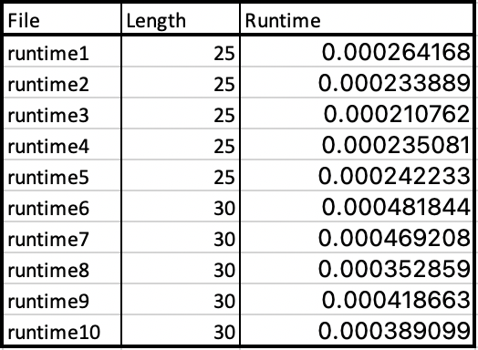
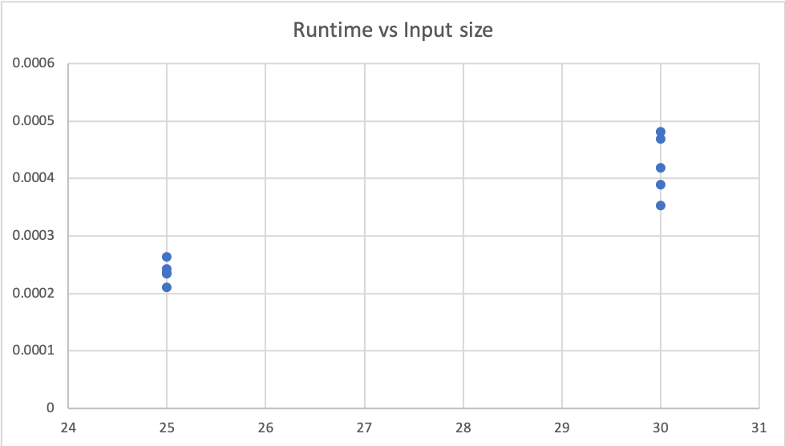
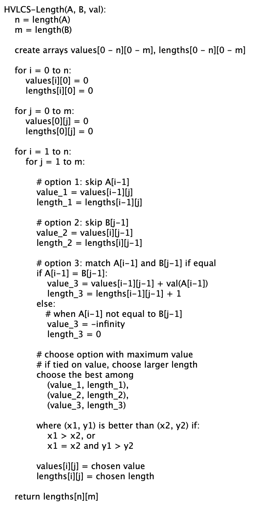

# COP4533-Assignment3

Paige Vanover
UFID: 22473613

Victoria Villasana
UFID: 86143370

## To get started:
- Clone the repository into your desired Python supported IDE.
- No external dependencies

## Running the Program
- Run dynamic.py and modify the filename variable inside main() to reference the input files that are inside the test/ file.
- For each input(1-10).txt file in the testfiles/, there is a corresponding file input(1-10).out with the expected output in the tests/ folder. The output that is printed after running the program should match the contents of the corresponding .out file.

## Assumptions:
- Input file has the following format:
    - First line: integer K (number of chars in the alphabet)
    - Next K lines: each contains a character and the value it is associated with
    - Next line: string A
    - Next line: string B

- All values are nonnegative
- Strings A and B are not empty
- When creating the program, we created sample output files in the tests folder for corresponding input files. The output in those output files should match the print output when running the program with the same input files.

## Question 1

### Runtime Results

    

The chart shows the runtime values of the algorithm for input sizes 25 and 30 testing different edge cases.

### Runtime Graph

    

## Question 2
Let $dp[i][j]$ = maximum value of a common subsequence of $A[0...i-1]$ and $B[0...j-1]$

$$
dp[i][j] = \begin{cases}
    0 & \text{if } i = 0 \text{ or } j = 0 \\
    dp[i-1][j-1] + val(A[i-1]) & \text{if } A[i-1] = B[j-1] \text{ and } i,j > 0 \\
    \max(dp[i-1][j], dp[i][j-1]) & \text{if } A[i-1] \neq B[j-1] \text{ and } i,j > 0
\end{cases}
$$

If either of the strings are empty, then there is automatically no common subsequence which explains the correctness of the base case. If there are characters that match, we include that character in the subsequence and add its value to the optimal solution. This works because dynamic programming breaks a problem into subproblems, so adding a matching character value to the optimal subsequence ensures a new optimal subsequence up to this point. If the characters don’t match then we don’t include those characters and choose the optimal subsequence to be the max of the optimal solution for A or the optimal solution for B and that makes sure that we are taking the most optimal value.

## Question 3

### Pseuocode

    

The pseudocode above first fills 2 DP tables, values and lengths where n = length(A) and m = length(B). The total number of operations is the number of table entries which is (n+1)(m+1). There is an outer loop which is run n times and an inner loop ran m times, so the total iterations is n x m. Therefore, the runtime is O(nm).